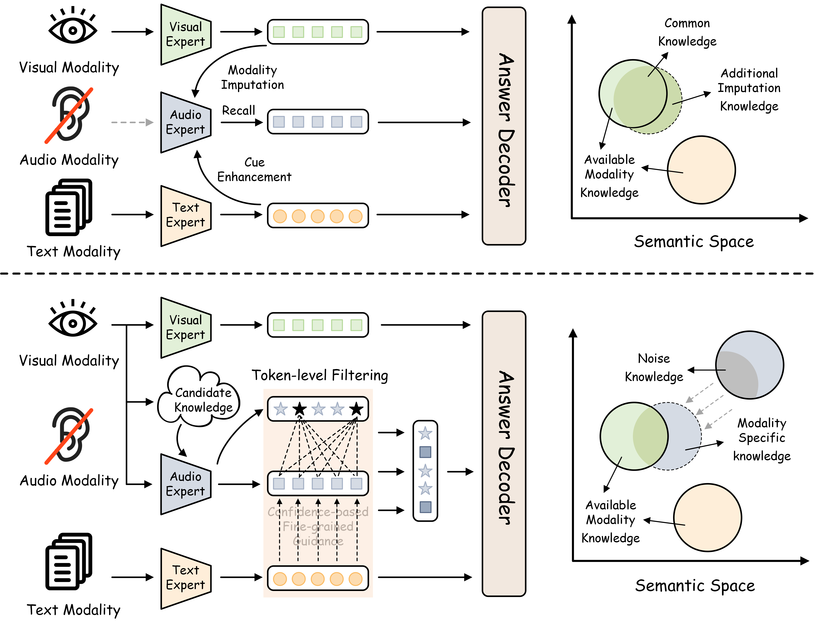

<div align="center">
<h2 class="papername"> Retrieving to Recover: Towards Incomplete Audio-Visual Question
Answering via Semantic-consistent Purification </h2>
<div>
    <a href="https://scholar.google.com/citations?user=Nt4QuMcAAAAJ&hl=zh-CN" target="_blank">Jiayu Zhang</a>,
    <a href="https://scholar.google.com.hk/citations?user=EWN-IogAAAAJ" target="_blank">Shuo Ye</a>, 
    <a href="https://scholar.google.com/citations?user=1joiJpUAAAAJ&hl=zh-CN" target="_blank">Qilang Ye</a>,
    <a href="https://github.com/Heisenberg10110" target="_blank"> Zihan Song</a>,
    <a href="https://github.com/Heisenberg10110" target="_blank"> Jiajian Huang</a>,
    <a href="https://scholar.google.com/citations?user=ziHejLwAAAAJ&hl=en" target="_blank">Zitong Yu*</a>
</div>

Great Bay University<br>
Nankai University<br>
Tsinghua University<br>
*Corresponding author<br>
[](https://arxiv.org/abs/2604.10695)

</div>

</div>

## :loudspeaker: News 

- [05/2026] :fire: The code is released. Enjoy it!
- [04/2026] :fire: [arXiv paper](https://arxiv.org/abs/2604.10695) released!
- [04/2026] :fire: Our paper has been accepted by ACL'26 (Main)!

## :bulb: Introduction 

This is the github repository of *Retrieving to Recover: Towards Incomplete Audio-Visual Question
Answering via Semantic-consistent Purification*. In this paper, we present $R^2ScP$, a framework that addresses missing modalities in AVQA by shifting from generative imputation to retrieval-based recovery. 
The comparison of traditional methods (top) and
$R^2ScP$ (bottom):

<div align="center">

</div>

## 📝 Citation

```bib
@article{zhang2026retrieving,
  title={Retrieving to Recover: Towards Incomplete Audio-Visual Question Answering via Semantic-consistent Purification},
  author={Zhang, Jiayu and Ye, Shuo and Ye, Qilang and Song, Zihan and Huang, Jiajian and Yu, Zitong},
  journal={arXiv preprint arXiv:2604.10695},
  year={2026}
}
```

## 🤗 Acknowledgement
* Lots of code are inherited from [AV-Master](https://github.com/AoKoo233/AV-Master) and [MoMKE](https://github.com/wxxv/MoMKE). Thanks for all these great works.
